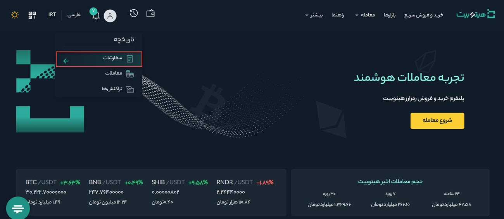

# مشاهده تاریخچه معاملات و سفارش‌ها
برای مشاهده تاریخچه معاملات و سفارش‌ها به صورت زیر عمل کنید:

1. وارد حساب کاربری خود شوید و از منوی **[سفارشات]** بر روی **[سفارشات]** کلیک کنید.

2. با کلیک بر روی **[تاریخچه سفارشات]**،  فهرست سفارشات  و اطلاعات مربوط به آنها از جمله تاریخ، جفت معاملاتی، طرف (خرید یا فروش)، نوع، قیمت، مقدار، میزان پرشده سفارش، کل مبلغ سفارش و وضعیت آن  نمایش داده می‌شود. شما می‌توانید سفارشات را بر اساس تاریخ، پایه، ارز و طرف (خرید یا فروش) فیلتر کنید.

3. با کلیک بر روی **[تاریخچه معاملات]**، فهرست معاملات انجام‌شده و اطلاعات مربوط به آنها از جمله تاریخ، جفت معاملاتی، طرف (خرید یا فروش)، مقدار، قیمت، میزان کارمزد، ارزی که کارمزد بر اساس آن محاسبه شده است و کل مبلغ معامله نمایش داده می‌شود. شما می‌توانید معاملات را بر اساس تاریخ، پایه، ارز، طرف (خرید یا فروش) فیلتر کنید.

