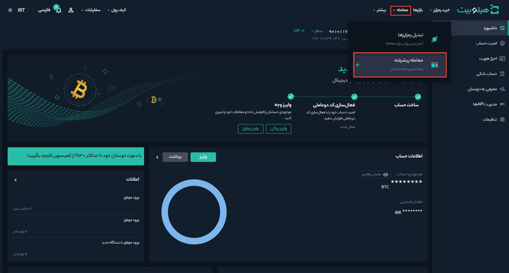
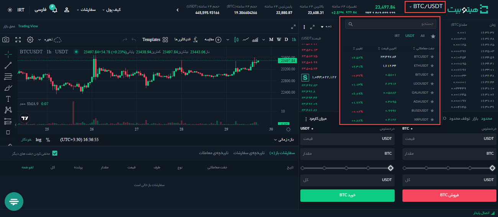
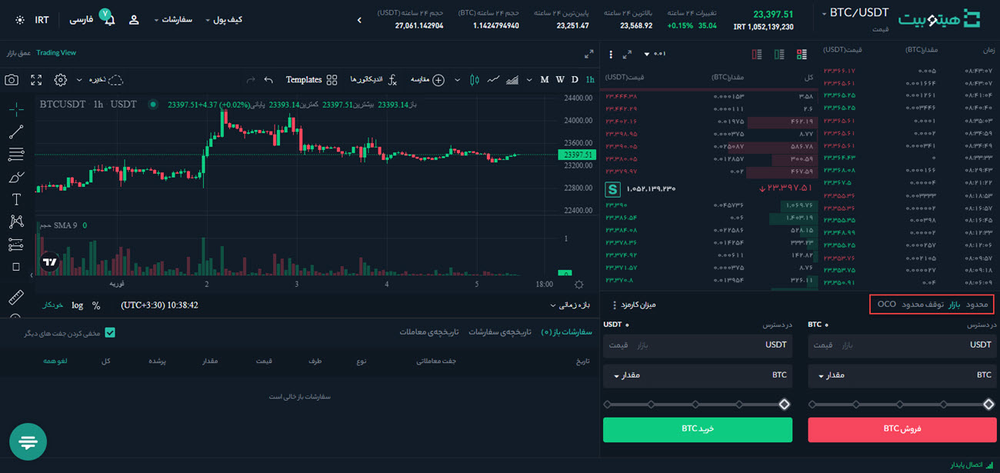
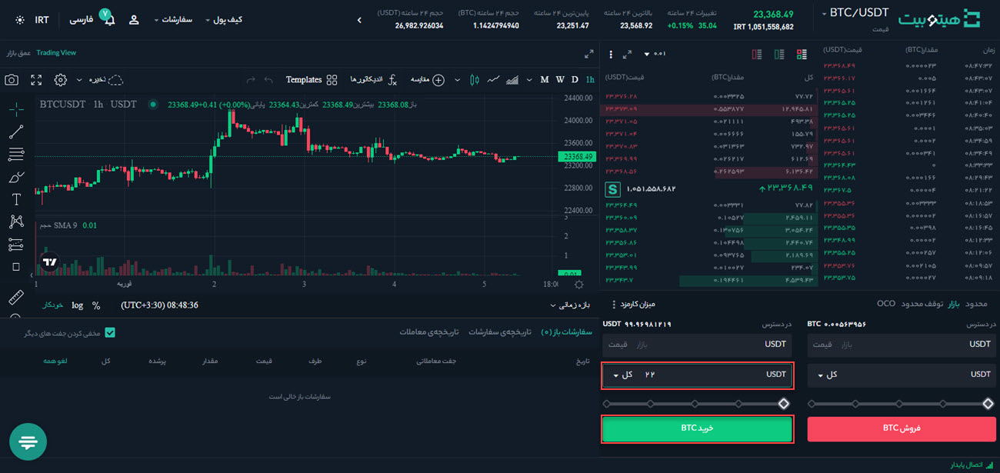
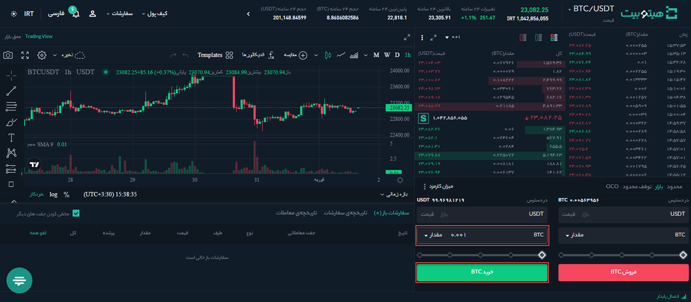
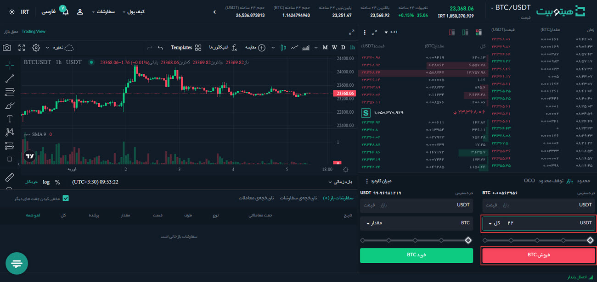
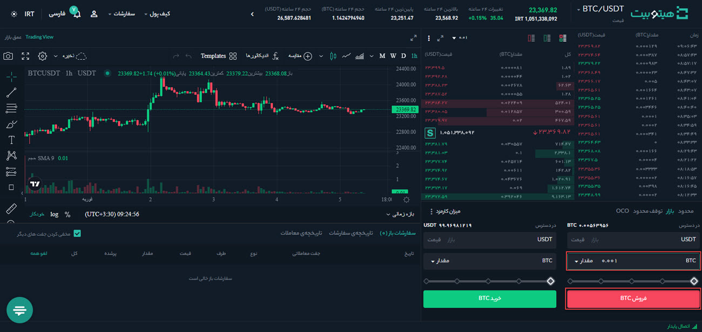

# سفارش Market چیست و چگونه می‌توان آن را ثبت کرد ؟

## سفارش بازار (Market) چیست؟

  سفارش بازار با قیمت فعلی بازار و در سریع‌ترین زمان ممکن انجام می‌شود.
هنگام ثبت سفارش بازار می‌توانید **[مقدار]** یا **[کل]** را برای خرید یا فروش انتخاب کنید.

به‌عنوان مثال زمانی که می‌خواهید مقدار مشخصی بیت کوین بخرید یا بفروشید، [**مقدار]** توصیه می‌شود، اما اگر می‌خواهید بیت کوین را با مقدار مشخصی از دارایی مانند 10000 تتر بخرید، سفارش بازار با **[کل]** گزینه بهتری است.

به‌طور کلی، شما می‌توانید از هر دو عملکرد برای سفارش خریدوفروش خود استفاده کنید. با این حال پس از محاسبه مبلغ و انجام سفارش‌ها ممکن است قیمت دارایی به‌طور قابل‌توجهی تغییر کند و به دنبال آن سفارش‌ها ناموفق باشند. این اتفاق اغلب زمانی روی می‌دهد که نسبت خرید/فروش نزدیک یا مساوی 100 درصد باشد.

## تفاوت بین سفارش Market  و سفارش limit  چیست؟

سفارش بازار یک سفارش برای خرید یا فروش فوری با بهترین قیمت موجود است و بر اساس سفارش‌هایی که قبلاً در لیست سفارش ثبت شدند، انجام می‌شود. این یعنی سفارش‌های بازار برای تکمیل شدن به نقدینگی بازار بستگی دارند. برخلاف سفارش‌های محدود که در لیست سفارش قرار می‌گیرند و منتظر می‌مانند تا کسی آنها را انتخاب کند، سفارش‌های بازار بلافاصله با قیمت فعلی بازار انجام می‌شوند، بنابراین هنگام تکمیل یک سفارش بازار در هیتوبیت، کارمزدهای معاملاتی را به‌عنوان سفارش بردار پرداخت خواهید کرد.

> **توجه**  
> - در شرایطی که بازار نوسان دارد سفارش‌های بازار ممکن است بلافاصله اجرا نشوند.
> - سفارش‌های بازار معاملاتی هستند که قرار است در سریع‌ترین زمان ممکن با قیمت فعلی بازار انجام شوند.
> - سفارش‌های محدود معاملاتی هستند (خرید یا فروش) که شما مایل به انجام آنها در قیمت مورد نظرتان هستید.
> - سفارش‌های بازار شانس بیشتری برای انجام‌شدن دارند.
> -  هیچ تضمین و قطعیتی در انجام سفارش‌ها وجود ندارد و موفقیت‌آمیز بودن آنها در قیمت‌های موردنظر، وابسته به شرایط بازار است. شما می‌توانید با استفاده از تحلیل و آگاهی خود، قیمت مناسبی را انتخاب کنید و درصد موفقیت سفارش‌های خود را بالا ببرید.
 
## نحوه ثبت سفارش بازار
برای ثبت سفارش بازار به صورت زیر عمل کنید:

1. وارد حساب کاربری خود شوید و از منوی **[معامله]** وارد صفحه **[معاملات پیشرفته]** شوید.

2. جفت ارز موردنظر خود را انتخاب کنید. فرض می‌کنیم می‌خواهید مقداری بیت کوین معامله کنید.

3. نوع سفارش را بر روی **[بازار]** قرار دهید.

4.  سفارش خرید را به ۲ روش زیر می‌توانید ثبت کنید:

  - **از طریق کل** 
 فرض کنید شما دارای 1000 تتر هستید و می‌خواهید برای BTC/USDT از نوع بازار سفارش‌گذاری کنید. پس از وارد کردن عدد مورد نظر در **[کل]**، بر روی **[خرید BTC]**  کلیک کنید. هنگامی که یک سفارش «خرید 100٪» را انجام می‌دهید، سیستم سفارش شما را با قیمت فعلی بازار و با توجه به مقدار تتر شما اجرا می‌کند، اما مشخص نیست که چه تعداد بیت کوین می‌توانید بخرید. مبلغ نهایی معامله بیت کوین با توجه به مقدار و قیمت بازار هنگام ثبت سفارش تعیین می‌شود. می‌توانید مقدار بیت کوین خریداری‌شده و میانگین قیمت را از **[تاریخچه سفارشات]** مشاهده کنید.

  

  - **از طریق مقدار** 
 فرض کنید شما دارای 100000 تتر هستید و قیمت BTC/USDT در حدود 50000 تتر در نوسان است.  پس از وارد کردن عدد مورد نظر خود در **[مقدار]**، بر روی **[خرید BTC]**  کلیک کنید. هنگامی که یک سفارش «خرید 100٪» را انجام می‌دهید، سیستم سفارش شما را با سفارش‌های فروش در بازار مطابقت می‌دهد تا مشخص کند که چند بیت کوین می‌توانید بخرید.
اگر سیستم محاسبه کند که شما می‌توانید به‌عنوان مثال 2 بیت کوین را با 100000 تتر بخرید و برای ثبت سفارش کلیک کنید، اما در همان زمان قیمت بیت کوین افزایش یابد، به این معنی است که با 100000 تتر دیگر نمی‌توان 2 بیت کوین خریداری کرد. در این صورت سفارش شما انجام نخواهد شد و می‌توانید با ویرایش دستی مقدار بیت کوین یا استفاده از عملکرد **[کل]**، سفارش دیگری ثبت کنید. 

5. سفارش فروش را به ۲ روش زیر می‌توانید ثبت کنید:
  
  - **از طریق کل** 
   فرض کنید دارای مقداری بیت‌ کوین هستید و می‌خواهید ۵۰ درصد آن را با سفارش بازار بفروشید. پس از وارد کردن عدد مورد نظر خود در **[کل]**، بر روی **[فروش BTC]**  کلیک کنید. تتر حاصل از فروش این میزان بیت کوین با توجه به مقدار و قیمت فعلی بازار هنگام ثبت سفارش تعیین می‌شود. می‌توانید مقدار تتر به‌دست‌ آمده از سفارش و میانگین قیمت فروش را از **[تاریخچه سفارشات]** مشاهده کنید.

  - **از طریق مقدار** 
فرض کنید دارای 2 بیت کوین هستید و قیمت BTC/USDT در حدود 50000 تتر در نوسان است. پس وارد کردن عدد موردنظر خود در  **[مقدار]**، بر روی **[فروش BTC]** کلیک کنید. هنگامی که یک سفارش «فروش 100٪» را انجام می‌دهید، سیستم سفارش شما را با سفارش‌های خرید موجود در بازار مطابقت می‌دهد تا تعیین کند چه مقدار تتر  می‌توانید دریافت کنید.
اگر سیستم محاسبه کند که شما می‌توانید  2 بیت کوین را به قیمت 50000 تتر بفروشید و برای ثبت سفارش فروش کلیک کنید، اما در همان زمان قیمت بیت کوین کاهش یابد، به این معنی است که 2 بیت کوین دیگر با قیمت 50000 تتر به فروش نمی‌رسد. در نتیجه سفارش شما ناموفق خواهد بود و می‌توانید با ویرایش دستی مقدار USDT   یا استفاده از عملکرد **[کل]**، سفارش دیگری ثبت کنید.

