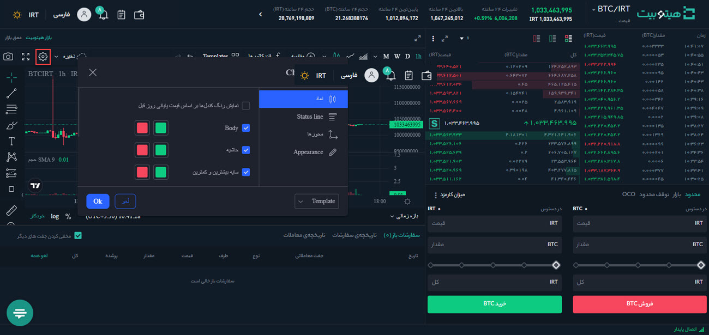
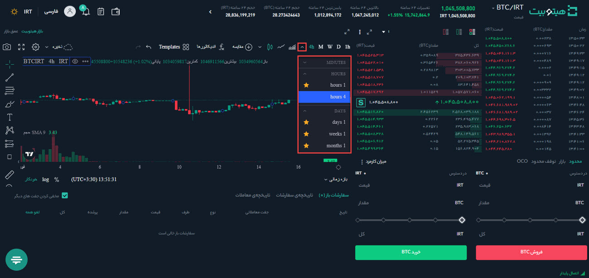
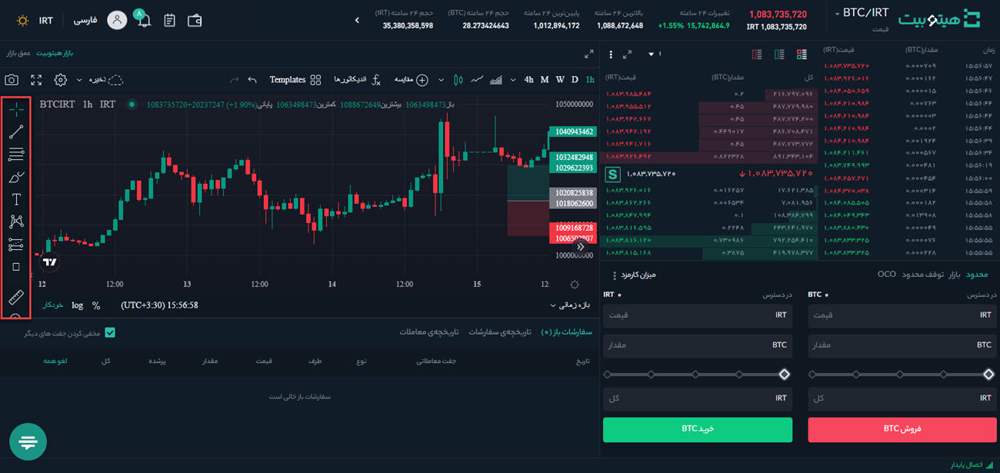
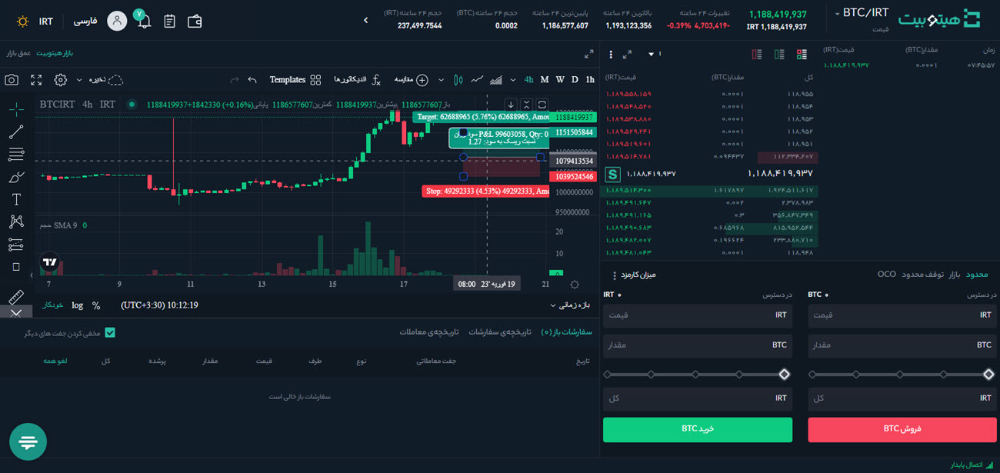
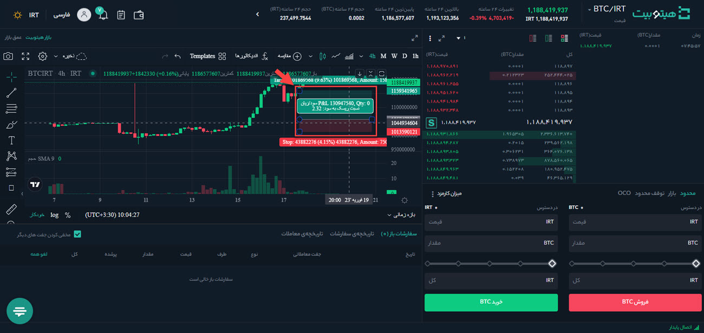
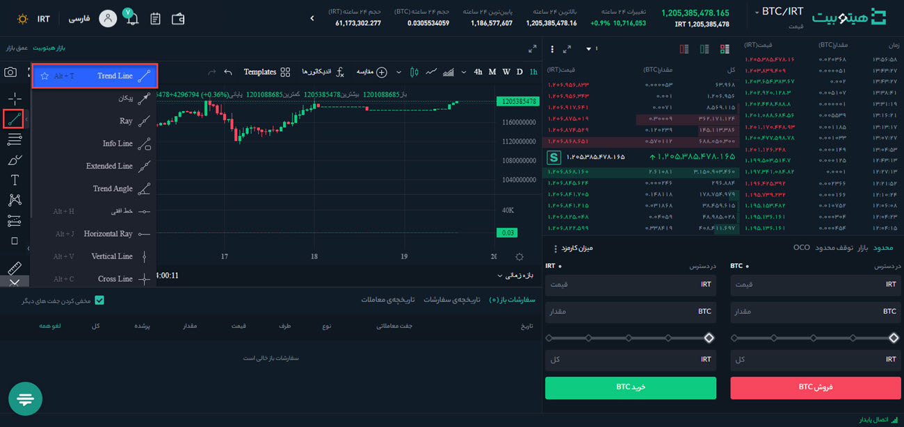

# نحوه استفاده از TradingView در وب‌سایت

سامانه معاملاتی هیتوبیت شامل مجموعه‌ای قوی از ابزارها و گزینه‌هایی است که به شما در تحلیل معاملاتتان کمک می‌کند. این مجموعه شامل موارد زیر است:

- نمودارهای شمعی
- ابزار رسم
- اندیکاتورها
- فواصل زمانی
- نمودارهای عمق

قابلیت TradingView  به کاربران اجازه می‌دهد تا یک مجموعه ابزار سفارشی برای تحلیل تکنیکال ایجاد کنند. در ادامه نحوه استفاده از آن را بررسی خواهیم کرد.

## ورود به TradingView

**1.**	وارد حساب کاربری خود شوید و در بالای صفحه سمت راست بر روی **[معامله پیشرفته]** کلیک کنید. 

**2.**	روی **[بازار هیتوبیت]** در بالای نمودار کلیک کنید تا به ابزارهای معاملاتی موجود و نمودارهای مختلف دسترسی کامل داشته باشید. 

توجه داشته باشید که میانگین‌های متحرک قبلاً در نمودار نمایش داده شده است. با کلیک روی نماد **[تنظیمات]** که در تصویر مشخص شده است  به تنظیمات آنها دسترسی پیدا می‌کنید. هر میانگین متحرک با توجه به بازه زمانی مشخص شده تنظیم می‌شود. به‌عنوان مثال MA(7) میانگین متحرک هفت شمع بازه زمانی شما است. اگر از نمودار یک‌ساعته استفاده می‌کنید میانگین متحرک 7 ساعته و اگر نمودار روزانه است میانگین متحرک 7 روزه نمایش داده می‌شود. 

**[عمق]** نمایشی بصری از سفارش‌های خرید یا فروش تکمیل نشده در لیست سفارش‌ها ارائه می‌دهد. این نمودار میزان عرضه و تقاضای بازار  را در قیمت‌های مختلف نشان می‌دهد. 

## نمودارهای شمعی

نمودارهای شمعی یا کندل استیک (Candlestick)، نمایشی گرافیکی از حرکات قیمت یک دارایی هستند. بازه زمانی هر کندل قابل تنظیم است و می‌تواند یک دوره معین را نشان دهد. هر کندل شامل قیمت باز شدن،  قیمت بسته شدن، بالا ترین قیمت، پایین ترین قیمت در دوره است. 
برای سفارشی کردن نمودار کندل استیک خود، روی هر یک از شمع‌ها در **[بازار هیتوبیت]** دو بار کلیک کنید تا تنظیمات آن ظاهر شود.

- به شما این امکان را می‌دهد که ظاهر کندل‌های خود را تغییر دهید **[نماد]** 
- **[Style]** به شما این امکان را می‌دهد که ظاهر کندل‌های خود را تغییر دهید.
- **[Scales]** گزینه‌های متعددی را برای مقیاس‌بندی و حاشیه کندل‌ها ارائه می‌دهد، از جمله مقیاس خودکار، مقیاس لگاریتمی و مقیاس درصد. 	
- **[پس‌زمینه]** گزینه‌هایی را برای تغییر ظاهر پس‌زمینه کندل‌ها ارائه می‌کند.
- **[Timezone/Sessions]** به شما این امکان را می‌دهد منطقه زمانی خود را انتخاب کنید.

## فواصل زمانی کندل‌ها 

بازه زمانی نمایش داده‌شده توسط هر کندل با انتخاب یکی از گزینه‌های پیش‌فرض در بالای نمودار قابل تغییر است. اگر به فواصل بیشتری نیاز دارید، روی فلش رو به پایین در سمت راست کلیک کنید. 
در اینجا می‌توانید بازه جدیدی را انتخاب کنید یا دکمه **[ویرایش]** را فشار دهید تا فواصل بیشتری به گزینه‌های پیش‌فرض خود اضافه کنید.

## ابزار رسم

سمت چپ نمودار چندین ابزار ترسیم را برای کمک به تحلیل نمودار ارائه می‌دهد. همچنین می‌توانید روی هر ابزار کلیک راست کنید تا تغییرات عملکرد اصلی ابزار را بیابید. 

## ابزارهای عمومی پرطرفدار
در ادامه برخی از ابزارهای پرطرفدار بررسی می‌شوند.
### Long/short position

ابزار موقعیت لانگ (Long) یا شورت (Short) به شما این امکان را می‌دهد که موقعیت معاملاتی را ردیابی یا شبیه‌سازی کنید. شما می‌توانید به‌صورت دستی سطوح ورودی، دریافت سود و توقف ضرر را تنظیم کنید. سپس نسبت ریسک به سود مربوطه را خواهید دید.

**1.**	ابزار **[Long Position]** یا **[Short Position]** را انتخاب کنید.

**2.**	برای ایجاد موقعیت لانگ/شورت خود، روی نمودار کلیک کنید. ناحیه سایه‌دار سبز نشان‌دهنده هدف شما (سود) است، در حالی که رنگ قرمز منطقه حد ضرر (زیان احتمالی) شما را نشان می‌دهد. همچنین می‌توانید نسبت ریسک به سود را مشاهده کنید. 

**3.** 	برای تغییر نسبت ریسک به سود، لبه‌های کادر را بکشید. Target تفاوت  بین قیمت ورودی شما و حد سود (Take Profit) را نشان می‌دهد. Stop تفاوت بین قیمت ورودی شما و حد ضرر (Stop loss) را نشان می‌دهد. 

**4.**	روی نمودار موقعیت لانگ/شورت دو بار کلیک کنید تا تنظیمات آن را ویرایش کنید. می‌توانید مقدار سرمایه‌گذاری را در **[موجودی حساب]** به همراه درصد ریسک خود تغییر دهید. **[Coordinates]** به شما این امکان را می‌دهد تا سود برداشت، قیمت ورودی و سطح توقف خود را به‌صورت عددی تغییر دهید، درحالی که **[Visibility]** سفارشی‌سازی گرافیکی را ارائه می‌دهد. 

### خط روند

در تحلیل تکنیکال روندها نقش مهمی دارند. شما به‌راحتی می‌توانید با افزودن خطوط 
روند به نمودار خود، روند بازار را تشخیص دهید. برای ایجاد خطوط روند، روی ابزار **[Trend Line]** کلیک کنید و ابتدا و انتهای خط روند خود را انتخاب کنید. ضخامت، رنگ و سایر ویژگی‌ها با استفاده از جعبه ابزار شناور قابل تنظیم هستند. 

### اندیکاتورهای تکنیکال

اندیکاتورها، مانند میانگین متحرک یا باندهای بولینگر، در سامانه معاملاتی قابل افزودن هستند.
برای مشاهده لیستی از همه گزینه‌های موجود، روی نماد **[اندیکاتورها]** کلیک کنید.
اندیکاتور پس از انتخاب در نمودار کندل استیک قابل‌مشاهده است. 

## نحوه تنظیم مجدد نمودار

برای حذف اندیکاتورها، کافی است روی آن کلیک کنید تا جعبه ابزار شناور ظاهر شود، سپس روی نماد حذف کلیک کنید.

اگر می‌خواهید کل نمودار را در حالت پیشفرض بازیابی کنید، روی هر نقطه از نمودار کلیک راست کرده و روی **[تنظیمات پیشفرض نمودار]** کلیک کنید، یا [Alt + R] را روی صفحه‌کلید خود فشار دهید. 

