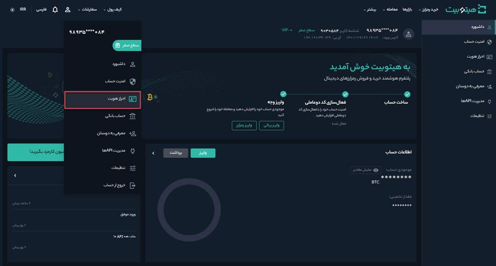
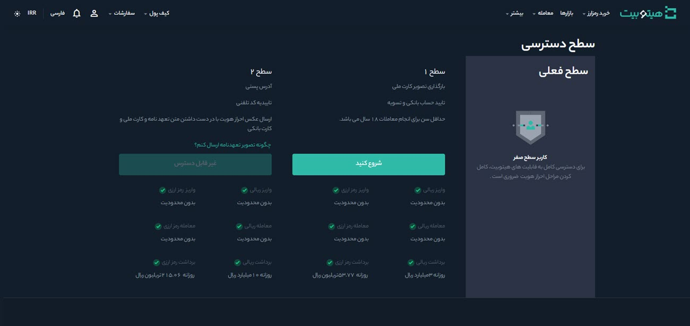
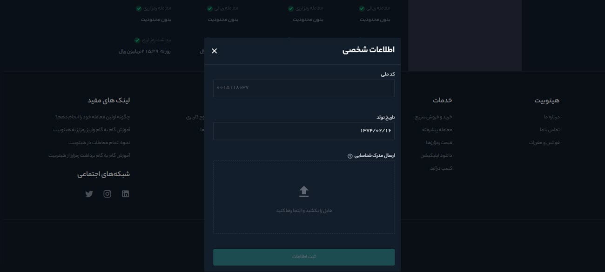

#  ارتقا حساب کاربری از سطح 0 به 1
پس از ثبت‌نام در هیتوبیت وارد سطح 0 حساب کاربری می‌شوید. در این سطح می‌توانید به‌صورت نامحدود واریز ریالی و رمزارزی داشته باشید، اما امکان برداشت وجود ندارد. از آنجا که محدودیت‌های معاملاتی بر اساس سطح دسترسی کاربر تعیین می‌شود، برای افزایش دسترسی‌های معاملاتی نیاز است که حساب کاربری خود را از سطح 0 به 1 ارتقا دهید. 

مدارکی که برای ارتقا به سطح 1 نیاز دارید شامل موارد زیر است:
- شماره تلفن همراهی که به نام کاربر است
- کد ملی
- تاریخ تولد
- تصویر کارت ملی (در صورت نداشتن کارت ملی تصویر صفحه اول شناسنامه قابل‌قبول است) 
برای شروع طبق مراحلی که در ادامه شرح داده می‌شود عمل کنید: 
**1.** پس از ورود به حساب کاربری از منوی پروفایل وارد **[احراز هویت]** شوید.

**2.**  در قسمت سطح 1 بر روی **[شروع کنید]** کلیک کنید.   

**3.** اطلاعات خود را مطابق تصویر تکمیل کنید.

> **توجه**   در صورتی که کاربر کارت ملی ندارد، می‌تواند از تصویر شناسنامه عکس‌دار جدید (حاوی شماره ملی) یا پاسپورت استفاده کند.

**4.**  در انتها بر روی ثبت اطلاعات کلیک کرده و منتظر نتیجه تایید مدارک و ارتقا به سطح 1 باشید. 
