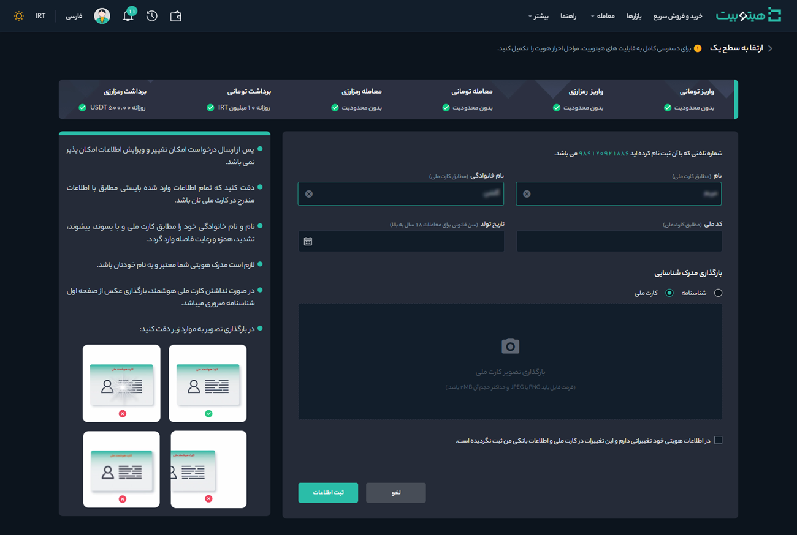

#  ارتقا حساب کاربری از سطح صفر به یک
پس از ثبت‌نام در هیتوبیت وارد سطح صفر حساب کاربری می‌شوید. در این سطح امکان [افزودن حساب بانکی](https://github.com/HitoBitCo/FAQDocs/blob/main/DepositWithdrawal/AddBankAccount.md) با وارد کردن اطلاعات شخصی و اطلاعات حسابتان وجود دارد. شما همچنین می‌توانید به‌صورت نامحدود واریز تومانی و رمزارزی داشته باشید. از آنجا که محدودیت‌های معاملاتی بر اساس سطح دسترسی کاربر تعیین می‌شود، برای افزایش دسترسی‌های معاملاتی نیاز است که حساب کاربری خود را از سطح صفر به یک ارتقا دهید. 

مدارکی که برای ارتقا به سطح یک نیاز دارید شامل موارد زیر است:
- شماره تلفن همراهی که به نام کاربر است
- کد ملی
- تاریخ تولد
- تصویر کارت ملی (در صورت نداشتن کارت ملی تصویر صفحه اول شناسنامه قابل‌قبول است)

برای شروع مطابق مراحل زیر عمل کنید: 
1. پس از ورود به حساب کاربری از منوی پروفایل وارد **[احراز هویت]** شوید.

2. در قسمت سطح یک بر روی **[ ارتقا به سطح یک]** کلیک کنید.   

3. اطلاعات هویتی شامل نام، نام خانوادگی، کد ملی و تاریخ تولد را مطابق با کارت ملی تکمیل و تصویر مدرک شناسایی را بارگذاری کنید.
 

>**توجه**  
هنگام ارتقا به سطح یک امکان ویرایش نام و نام خانوادگی که کاربر در سطح صفر وارد کرده است وجود دارد.

4. در صورتی که کاربر کارت ملی ندارد، می‌تواند از تصویر شناسنامه عکس‌دار جدید (حاوی شماره ملی) استفاده کند. در صورت داشتن صفحه توضیحات، گزینه مربوطه را فعال و تصویر آن را بارگذاری کنید.

5.  در انتها بر روی دکمه **[ثبت اطلاعات]** کلیک کرده و منتظر نتیجه تأیید مدارک و ارتقا به سطح یک باشید. 
