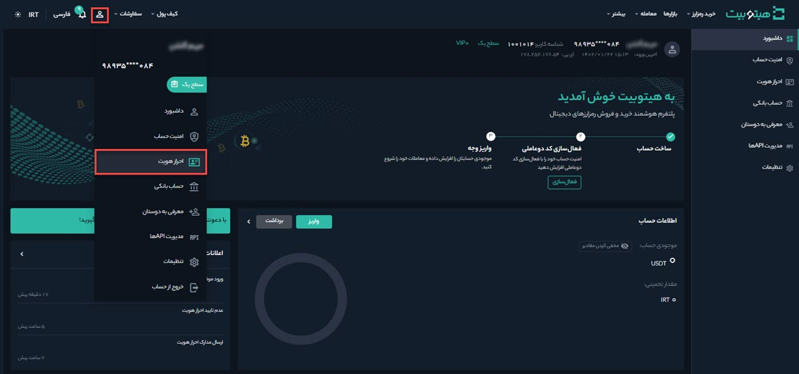
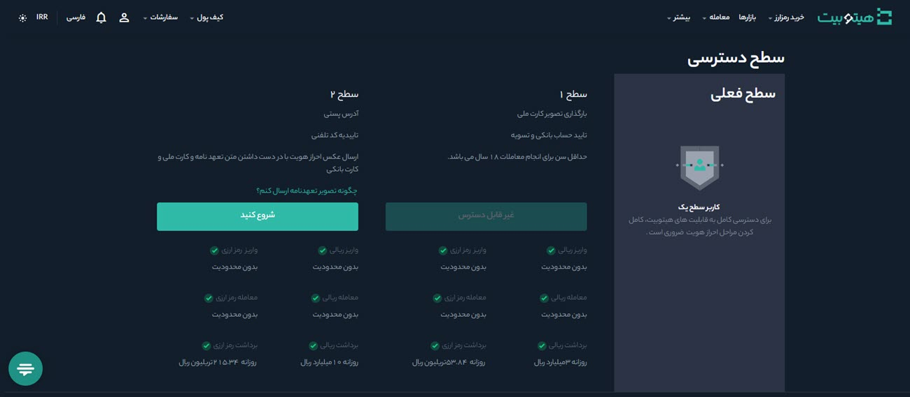
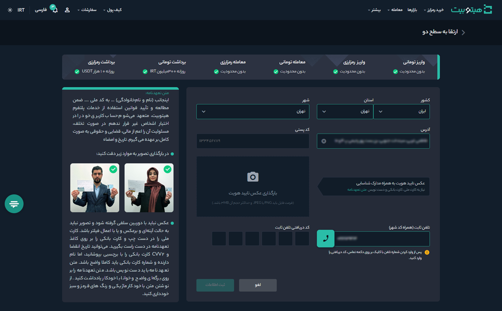
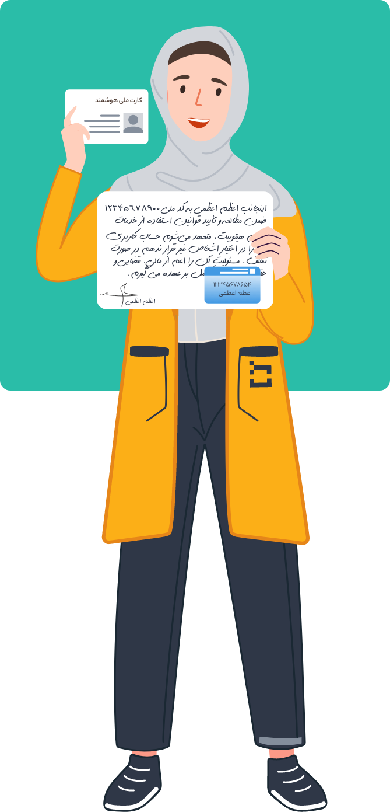

# ارتقا حساب کاربری از سطح 1 به 2
 به‌منظور کاهش محدودیت‌های معاملاتی، پس ارتقا حساب کاربری به سطح 1 می‌توانید برای ارتقا به سطح 2 اقدام کنید. اطلاعاتی که برای ارتقا به سطح 2 نیاز دارید شامل موارد زیر است:

- آدرس کامل پستی
- کد پستی
- تلفن ثابت تأییدشده
- عکس سلفی احراز هویت 

برای شروع طبق مراحل زیر عمل کنید:

**1.**  پس از ورود به حساب کاربری از منوی پروفایل وارد **[احراز هویت]** شوید.

**2.**  در قسمت **سطح 2** بر روی **[شروع کنید]** کلیک کنید.      

**3.** اطلاعات خواسته‌شده را مطابق تصویر تکمیل کنید.

**4.**   عکس تأیید هویت به‌همراه مدارک شناسایی را به‌صورتی که در بخش بعدی شرح داده می‌شود تهیه و در قسمت مربوطه بارگذاری کنید. 
**5.** برای تأیید شماره تلفن ثابتی که ثبت کرده‌اید، با آن تماس گرفته می‌شود و یک کد 5 رقمی خوانده می‌شود. کد را در جایی یادداشت کرده و در قسمت مربوطه وارد کنید. اگر به تلفن ثابت دسترسی ندارید از آدرس و شماره تماس آشنایان یا بستگان خود استفاده کنید. 
> **توجه**   تلفن ثابتی که وارد می‌کنید باید شماره تماس آدرسی باشد که ثبت کرده‌اید.

**6.** در انتها بر روی **[ثبت اطلاعات]** کلیک کرده و منتظر نتیجه تأیید مدارک و ارتقا به سطح 2 باشید.
## نحوه تهیه عکس تأیید هویت
1.متن تعهدنامه را بر روی برگه‌ای واضح و خوانا با خودکار یادداشت کنید.

متن تعهدنامه:

اینجانب (نام و نام‌خانوادگی) ... به کد ملی .... ضمن مطالعه و تأیید قوانین استفاده از خدمات پلتفرم هیتوبیت، متعهد می‌شوم حساب کاربری خود را در اختیار اشخاص غیر قرار ندهم. در صورت تخلف، مسئولیت آن را اعم از مالی، قضایی و حقوقی به‌صورت کامل بر عهده می گیرم.

تاریخ

امضاء

>**توجه**  
متن تعهدنامه باید دست‌نویس باشد. 
 از نوشتن متن با خودکار ماژیکی و رنگ های قرمز و سبز خودداری کنید.

2. کارت ملی و کارت بانکی که قبلا اطلاعاتشان را در هیتوبیت ثبت کرده‌اید مطابق تصویر در دست بگیرید.
کارت ملی را در دست چپ و کارت بانکی را بر روی کاغذ تعهدنامه بچسبانید و در دست راست بگیرید. می‌توانید تاریخ انقضا و CVV2 کارت بانکی را با برچسبی بپوشانید، اما نام دارنده و شماره کارت بانکی باید کاملاً واضح باشد.

3. از فردی بخواهید مطابق تصویر از شما عکس بگیرد (تصویر نباید سلفی گرفته شود). هر دو دست و چهره کامل در عکس بیافتد و واضح باشد. می‌توانید قبل از گرفتن عکس لنزهای دوربین را تمیز کنید تا عکس با کیفیت بالا و بدون تاری باشد. 

>**توجه** 
دقت داشته باشید که دست‌هایتان هیچ اطلاعات مهمی را نپوشانده باشد. 
عکس نباید با دوربین سلفی گرفته شود و تصویر نباید به حالت آینه‌ای و برعکس باشد.
 
 

