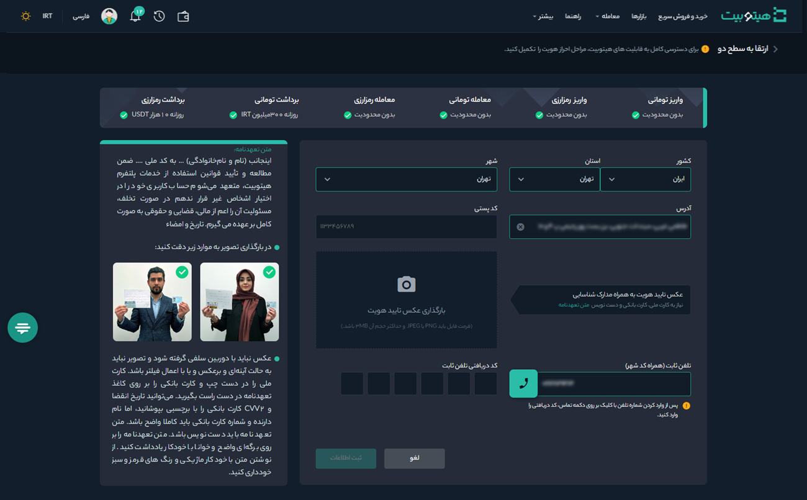

# ارتقا حساب کاربری از سطح 1 به 2
 به‌منظور کاهش محدودیت‌های معاملاتی، پس ارتقا حساب کاربری به سطح 1 می‌توانید برای ارتقا به سطح 2 اقدام کنید. اطلاعاتی که برای ارتقا به سطح 2 نیاز دارید شامل موارد زیر است:

- آدرس کامل پستی
- کد پستی
- تلفن ثابت تأییدشده
- عکس سلفی احراز هویت 

برای شروع طبق مراحل زیر عمل کنید:

**1.**  پس از ورود به حساب کاربری از منوی پروفایل وارد **[احراز هویت]** شوید.

**2.**  در قسمت **سطح 2** بر روی **[شروع کنید]** کلیک کنید.      

**3.** اطلاعات خواسته‌شده را مطابق تصویر تکمیل کنید.

**4.**   عکس تأیید هویت به‌همراه مدارک شناسایی را تهیه و در قسمت مربوطه بارگذاری کنید. برای اطلاعات بیشتر به [راهنمای تهیه عکس تأیید هویت]() مراجعه کنید.  
**5.** برای تأیید شماره تلفن ثابتی که ثبت کرده‌اید، با آن تماس گرفته می‌شود و یک کد 5 رقمی خوانده می‌شود. کد را در جایی یادداشت کرده و در قسمت مربوطه وارد کنید. اگر به تلفن ثابت دسترسی ندارید از آدرس و شماره تماس آشنایان یا بستگان خود استفاده کنید. 
> **توجه**   تلفن ثابتی که وارد می‌کنید باید شماره تماس آدرسی باشد که ثبت کرده‌اید.

**6.** در انتها بر روی **[ثبت اطلاعات]** کلیک کرده و منتظر نتیجه تأیید مدارک و ارتقا به سطح 2 باشید.

