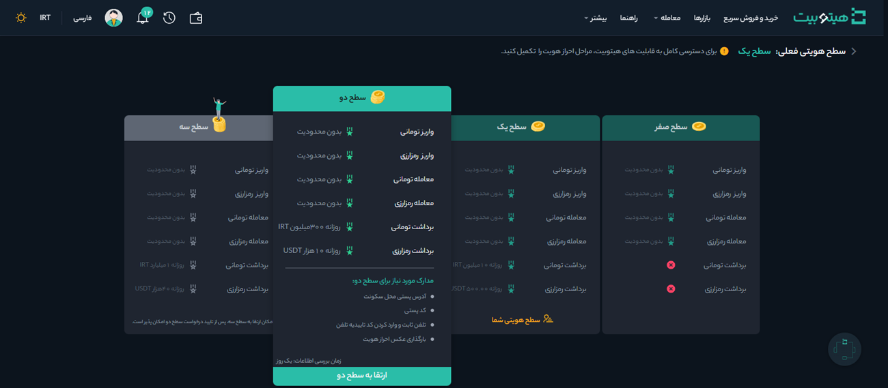

# ارتقا حساب کاربری از سطح یک به دو
 به‌منظور کاهش محدودیت‌های معاملاتی، پس از ارتقا حساب کاربری به سطح یک می‌توانید برای ارتقا به سطح دو اقدام کنید. اطلاعاتی که برای ارتقا به سطح دو نیاز دارید شامل موارد زیر است:

- آدرس پستی محل سکونت
- کد پستی
- تلفن ثابت و وارد کردن کد تأییدیه تلفن
- عکس سلفی احراز هویت 

برای شروع مطابق مراحل زیر عمل کنید:

**1.**  پس از ورود به حساب کاربری از منوی پروفایل وارد **[احراز هویت]** شوید.

**2.**  در قسمت **سطح دو** بر روی **[ارتقا به سطح دو]** کلیک کنید.      

**3.** اطلاعات مربوط به محل سکونت را وارد کنید.

**4.**   عکس تأیید هویت به‌همراه مدارک شناسایی را تهیه و در قسمت مربوطه بارگذاری کنید. برای اطلاعات بیشتر به [راهنمای تهیه عکس تأیید هویت](https://github.com/HitoBitCo/FAQDocs/blob/main/UserAccount/Authentication/AuthenticationImageGuide.md) مراجعه کنید.  
**5.** برای تأیید شماره تلفن ثابتی که ثبت کرده‌اید، با آن تماس گرفته می‌شود و یک کد 5 رقمی خوانده می‌شود. کد را در جایی یادداشت کرده و در قسمت مربوطه وارد کنید. اگر به تلفن ثابت دسترسی ندارید از آدرس و شماره تماس آشنایان یا بستگان خود استفاده کنید. 
> **توجه**   تلفن ثابتی که وارد می‌کنید باید شماره تماس آدرسی باشد که ثبت کرده‌اید.

**6.** در انتها بر روی **[ثبت اطلاعات]** کلیک کرده و منتظر نتیجه تأیید مدارک و ارتقا به سطح دو باشید.

