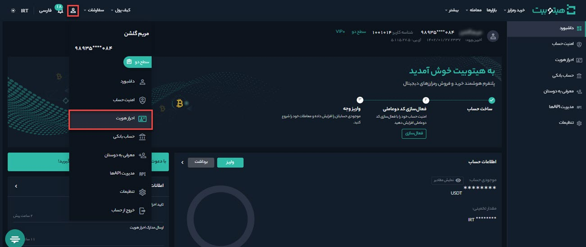
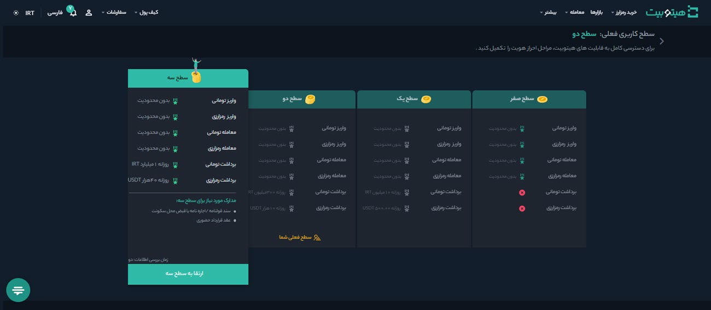
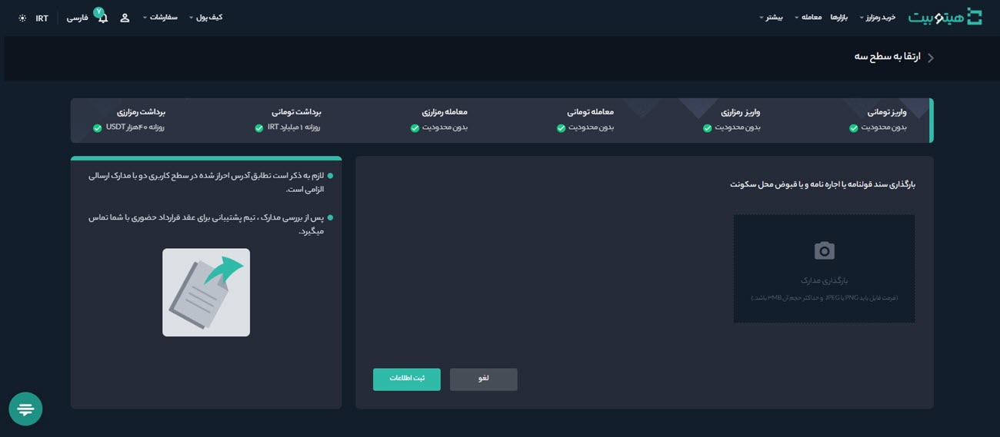

# ارتقا حساب کاربری از سطح دو به  سه  
پس از ارتقا حساب کاربری به سطح دو، به‌منظور افزایش دسترسی‌های معاملاتی می‌توانید حساب کاربری خود را به سطح سه ارتقا دهید. برای ارتقا حساب کاربری به سطح سه مدارک زیر موردنیاز است: 

- سند قولنامه/اجاره‌نامه یا قبوض محل سکونت
- عقد قرارداد حضوری

>**توجه** 
برای قبوض محل سکونت باید فایل معتبر ارائه شود.

برای ارتقا حساب کاربری به سطح سه به‌صورت زیر عمل کنید:

**1.**  پس از ورود به حساب کاربری از منوی پروفایل وارد **[احراز هویت]** شوید.

**2.**   در قسمت **سطح سه** بر روی **[ارتقا به سطح سه]** کلیک کنید.

**3.**  تصویر سند قولنامه یا اجاره‌نامه یا یکی از قبوض محل سکونت را بارگذاری کنید.

**4.** در انتها بر روی **[ثبت اطلاعات]** کلیک کرده و منتظر نتیجه تأیید مدارک و هماهنگی برای عقد قرارداد حضوری باشید.
      