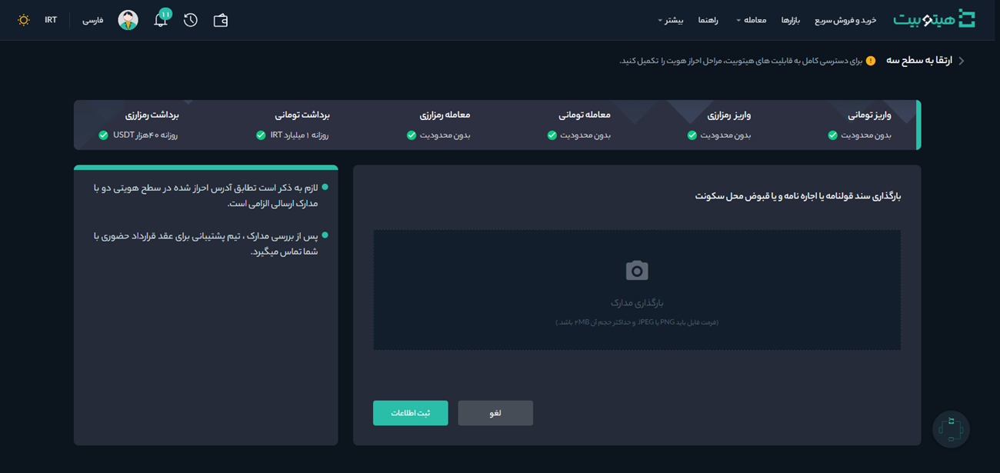

# ارتقا حساب کاربری از سطح 2 به سطح 3 و ویژه
پس از ارتقا حساب کاربری به سطح 2، به‌منظور افزایش سقف برداشت و کاهش محدودیت‌های معاملاتی می‌توانید برای ارتقا به سطح 3 اقدام کنید. مدارک مورد نیاز برای ارتقا حساب کاربری به سطح 3 شامل موارد زیر است:

- سند قولنامه یا اجاره‌نامه یا قبوض محل سکونت
- عقد قرارداد حضوری

>**توجه** 
برای قبوض محل سکونت باید فایل معتبر ارائه شود.

برای ارتقا حساب کاربری به سطح 3 به‌صورت زیر عمل کنید:

**1.**  پس از ورود به حساب کاربری از منوی پروفایل وارد **[احراز هویت]** شوید.

**2.**   در قسمت **سطح 3** بر روی **[شروع کنید]** کلیک کنید.

**3.**  تصویر سند قولنامه یا اجاره‌نامه یا یکی از قبوض محل سکونت را بارگذاری کنید.

**4.** در انتها بر روی **[ثبت اطلاعات]** کلیک کرده و منتظر نتیجه تأیید مدارک و هماهنگی برای عقد قرارداد حضوری باشید.
## ارتقا حساب کاربری به سطح ویژه
سطح ویژه آخرین سطح کاربری در هیتوبیت است. ارتقا حساب کاربری به سطح ویژه نیازمند عقد قرارداد حضوری برای دستیابی به شرایط توافقی است. 