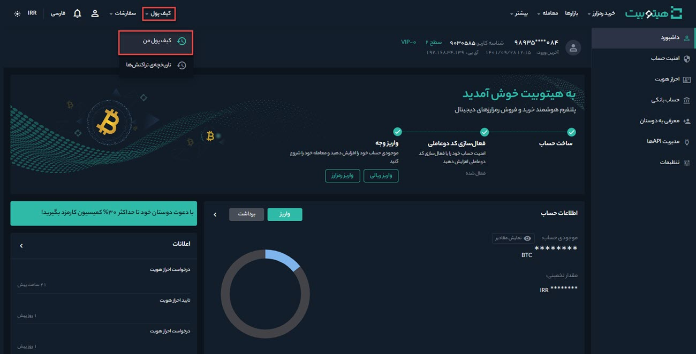
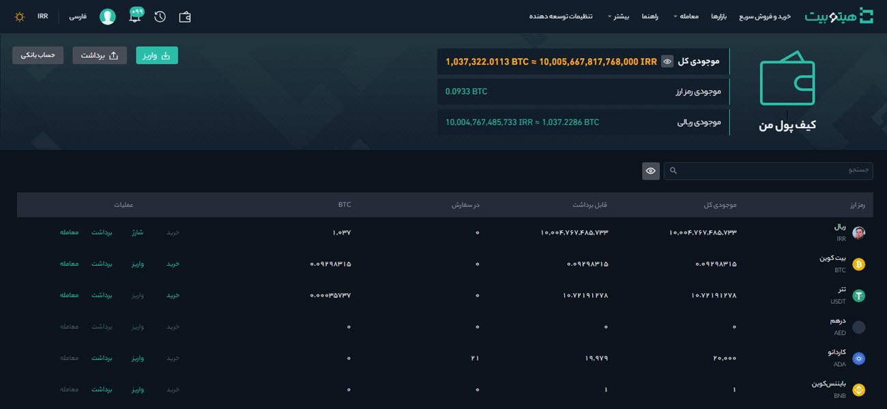
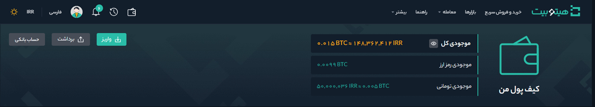
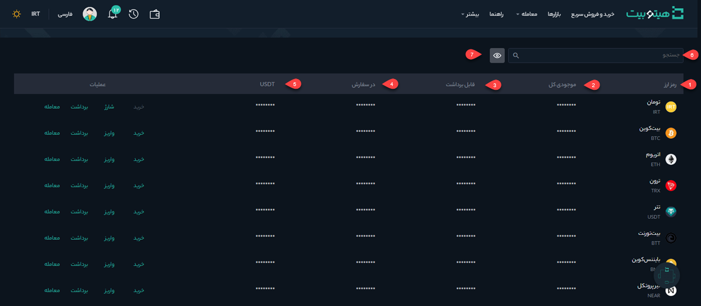

# کیف پول دیجیتال
 کیف پول این امکان را در اختیار شما می‌گذارد که علاوه بر مشاهده موجودی حساب خود، عملیات واریز، برداشت و تعریف حساب‌های بانکی را انجام دهید. برای دسترسی به کیف پول، وارد حساب کاربری خود شوید و از منوی کیف پول بر روی **[کیف پول من]** کلیک کنید.

   صفحه‌ای مطابق شکل زیر باز می‌شود که بخش‌های مختلف آن در ادامه بررسی می‌شود.

## موجودی کیف پول
موجودی‌ کیف پول خود را می‌توانید در این قسمت مشاهده کنید. این موجودی شامل موارد زیر می‌شود: 

**1.**   **موجودی کل** کیف پول شما به‌صورت تومانی و رمزارزی در **[موجودی کل]** قابل‌مشاهده است.  
>**توجه** 
برای نمایش یا پنهان کردن موجودی کیف پول خود روی آیکون چشم کلیک کنید. 

**2.** **مقدار رمزارز** موجود در کیف پول در **[موجودی رمزارز]** نمایش داده می‌شود.  
**3.**  **موجودی تومانی** کیف پول شما و معادل رمزارزی آن به‌صورت  تقریبی در  **[موجودی تومانی]** نمایش داده می‌شود.  
>**توجه** 
به‌دلیل نوسان قیمت‌ در بازار رمزارزها، موجودی کیف پول به‌صورت تخمینی نمایش داده می‌شود.

## عملیات انجام‌پذیر در کیف پول
شما می‌توانید در کیف پول خود عملیات زیر را انجام دهید:

 **1.** با کلیک بر روی دکمه  **[واریز]** به صفحه **واریز** هدایت می‌شوید. در این صفحه می‌توانید [واریز تومانی](https://github.com/HitoBitCo/FAQDocs/blob/main/DepositWithdrawal/FiatDeposit.md) انجام دهید. با وارد کردن مبلغ موردنظر خود به درگاه پرداخت هدایت می‌شوید و پس از پرداخت، حساب شما شارژ می‌شود. همچنین با کلیک بر روی دکمه [واریز رمزارز](https://github.com/HitoBitCo/FAQDocs/blob/main/DepositWithdrawal/DepositCryptoCurrencyGuide.md) می‌توانید رمزارز و شبکه آن را انتخاب کنید، آدرس کیف پول خود را دریافت و رمزارز موردنظر خود را به آن واریز کنید.  
 **2.** با کلیک بر روی دکمه **[برداشت]** به صفحه [برداشت رمزارز](https://github.com/HitoBitCo/FAQDocs/blob/main/DepositWithdrawal/WithdrawCryptoCurrencyGuide.md) هدایت می‌شوید. در این صفحه می‌توانید با وارد کردن آدرس کیف پول مقصد، رمزارز موردنظر را از کیف پول خود برداشت کنید و به کیف پول مقصد انتقال دهید. همچنین  با کلیک بر روی دکمه **[برداشت تومانی]**، انتخاب بانک و وارد کردن مبلغ می‌توانید درخواست برداشت تومانی خود را ثبت کنید.   
**3.** با کلیک بر روی دکمه **[حساب بانکی]**،  وارد صفحه حساب بانکی می‌شوید. در این صفحه با وارد کردن اطلاعات شخصی و اطلاعات حساب می‌توانید حساب بانکی خود را اضافه کنید. 

## فهرست رمزارزها و عملیات قابل‌انجام بر روی آن‌ها
 در این قسمت فهرستی از رمزارزهای مختلف، اطلاعاتی درباره آنها و عملیاتی که بر روی آنها انجام‌پذیر است نمایش داده می‌شود.

**1.** نام هر رمزارز و نماد اختصاری آن در ستون **[رمزارز]** نمایش داده می‌شود. 
**2.**  موجودی کل هر رمز ارز در **[موجودی کل]** نمایش داده می‌شود. 
**3.**   مقدار قابل برداشت هر رمزارز در  **[قابل برداشت]** نمایش داده می‌شود. 
**4.** مقداری از کل موجودی رمزارز که مربوط به سفارش در انتظار تأیید است در ستون **[در سفارش]** نمایش داده می‌شود. 
**5.**  موجودی هر رمزارز بر حسب تتر، در ستون **[USDT]** نمایش داده می‌شود. 
**6.**  عملیات انجام‌پذیر بر روی هر رمزارز شامل شارژ تومانی، خريد، واريز، برداشت و معامله در **[عملیات]** قابل‌مشاهده است. 
**7.** رمزارز موردنظر خود را می‌توانید در این قسمت جستجو کنید. 
**8.**  با این گزینه مقادیر کوچک مخفی می‌شوند.

