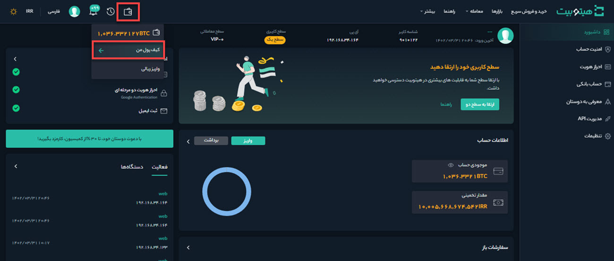

# دسترسی به کیف پول
 برای دسترسی به کیف پول، وارد حساب کاربری خود شوید و از منوی کیف پول بر روی **[کیف پول من]** کلیک کنید.

   صفحه‌ای مطابق شکل زیر باز می‌شود که بخش‌های مختلف آن در ادامه بررسی می‌شود.

## موجودی کیف پول
در این قسمت جزئیات مربوط به موجودی کیف 
پول  شرح داده می‌شود.

**1.**   موجودی کل کیف پول شما به‌صورت تومانی و رمزارزی در **[موجودی کل]** قابل‌مشاهده است.  
>**توجه** 
برای نمایش یا پنهان کردن موجودی کیف پول خود روی آیکون چشم کلیک کنید. 

**2.** مقدار رمزارز موجود در کیف پول و معادل تومانی آن به‌صورت تقریبی در **[موجودی رمزارز]** نمایش داده می‌شود.  
**3.**  موجودی تومانی کیف پول شما و معادل رمزارزی آن به‌صورت  تقریبی در  **[موجودی تومانی]** نمایش داده می‌شود.  
>**توجه** 
به‌دلیل نوسان قیمت‌ در بازار رمزارزها، موجودی کیف پول به‌صورت تخمینی نمایش داده می‌شود.

## عملیات انجام‌پذیر در کیف پول
شما می‌توانید در کیف پول خود عملیات مختلفی انجام دهید که در ادامه به آنها اشاره می‌شود.

 **1.** با کلیک بر روی دکمه  **[واریز]** به صفحه [واریز رمزارز](https://github.com/HitoBitCo/FAQDocs/blob/main/DepositWithdrawal/DepositCryptoCurrencyGuide.md) هدایت می‌شوید. در این صفحه می‌توانید آدرس کیف پول خود را دریافت و رمزارز موردنظر را به آن واریز کنید. 
 **2.** با کلیک بر روی دکمه **[برداشت]** به صفحه [برداشت رمزارز](https://github.com/HitoBitCo/FAQDocs/blob/main/DepositWithdrawal/WithdrawCryptoCurrencyGuide.md) هدایت می‌شوید. در این صفحه می‌توانید با وارد کردن آدرس کیف پول مقصد، رمزارز موردنظر را از کیف پول خود برداشت کنید و به کیف پول مقصد انتقال دهید.  
**3.** با کلیک بر روی دکمه **[حساب بانکی]**،  وارد صفحه حساب بانکی می‌شوید. در این صفحه با ثبت شماره حساب و شماره شبا می‌توانید حساب بانکی خود را اضافه کنید. 
**4.** با کلیک بر روی **[تاریخچه تراکنش‌ها]**، وارد صفحه تاریخچه تراکنش‌ها می‌شوید. در این صفحه فهرستی از تراکنش‌های تومانی و رمز ارزی در بازه زمانی انتخابی نمایش داده می‌شود. 
## فهرست رمزارزها و عملیات قابل‌انجام بر روی آنها
 در این قسمت فهرستی از رمزارزهای مختلف، اطلاعاتی درباره آنها و عملیاتی که بر روی آنها انجام‌پذیر است نمایش داده می‌شود.

**1.** علامت اختصاری رمزارز در ستون **[رمزارز]** نمایش داده می‌شود. 
**2.**  موجودی کل هر رمز ارز در **[موجودی کل]** نمایش داده می‌شود. 
**3.**   مقدار قابل برداشت هر رمزارز در  **[قابل برداشت]** نمایش داده می‌شود. 
**4.** مقداری از کل موجودی رمزارز که مربوط به سفارش در انتظار تأیید است در ستون **[در سفارش]** نمایش داده می‌شود. 
**5.**  موجودی هر رمزارز بر حسب بیت کوین، در ستون **[BTC]** نمایش داده می‌شود. 
**6.**  عملیات انجام‌پذیر بر روی هر رمزارز شامل شارژ، خريد، واريز، برداشت، معامله در **[عملیات]** قابل‌مشاهده است. 
**7.** رمزارز موردنظر خود را می‌توانید در این قسمت جستجو کنید. 
**8.**  با فعال کردن تیک این گزینه مقادیر کوچک مخفی می‌شوند.

