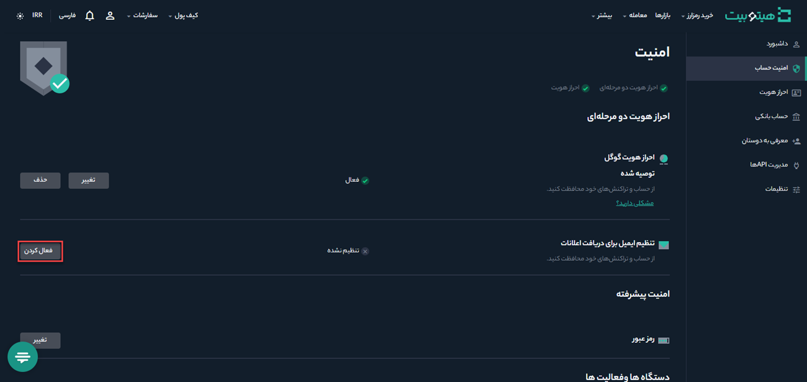
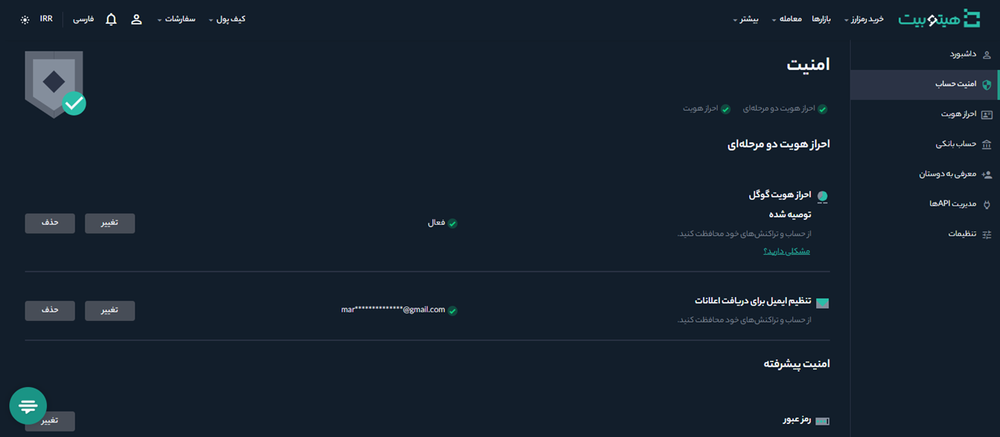

#  فعال‌کردن ایمیل بر روی حساب کاربری
**1.** برای تنظیم ایمیل جهت دریافت اعلانات، از حساب کاربری خود  وارد **[امنیت حساب]**  شوید.

**2.** در قسمت **[تنظیم ایمیل برای دریافت اعلانات]** بر روی **[فعال‌کردن]** کلیک کنید.

**3.**    ایمیل موردنظر خود را در **[ایمیل]**  وارد کنید. در قسمت  **[کد تأیید ایمیل]**  و **[کد امنیتی شماره تلفن]** بر روی  **[دریافت کد]**   کلیک و کدهایی را که به ایمیل و موبایل شما ارسال می‌شود وارد کنيد. کد دریافت‌شده در Google Authenticator   را نیز در  **[کد احراز هویت]** وارد و بر روی **[ارسال]** کلیک کنید.

**4.**  اکنون ایمیل بر روی حساب کاربری شما فعال شده است و در قسمت **[تنظیم ایمیل برای دریافت اعلانات]** نمایش داده می‌شود.

