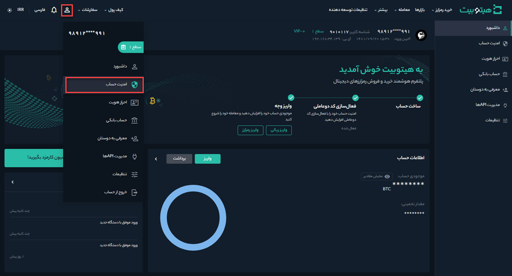
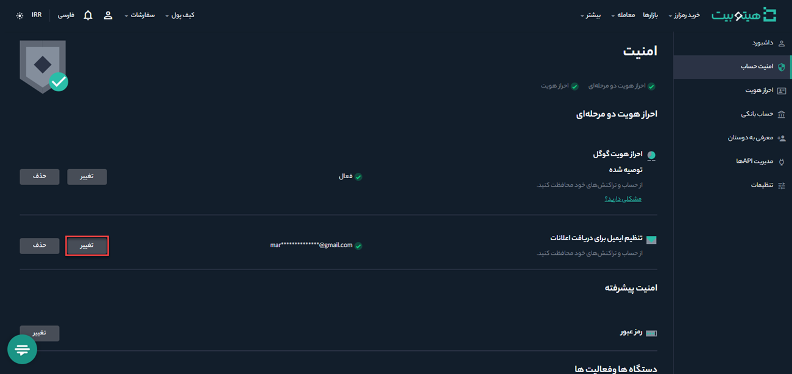
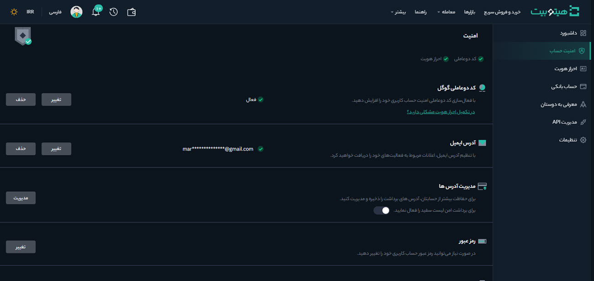

# تغییر ایمیل
**1.**   برای تغییر ایمیل وارد حساب کاربری خود شوید و از منوی پروفایل صفحه **[امنیت حساب]** را باز کنید.

**2.** در قسمت **[تنظیم ایمیل برای دریافت اعلانات]** بر روی تغییر کلیک کنید.

**3.** پیغامی مطابق تصویر زیر نمایش داده می‌شود و محدودیت‌هایی که پس از تغییر ایمیل ایجاد می‌شوند به شما اطلاع داده خواهد شد. در صورت موافقت بر روی تأیید کلیک کنید.

> **توجه** 
به‌منظور محافظت از حساب شما خدمات برداشت، فروش P2P و پرداخت به‌مدت 24 ساعت پس از انجام این تغییر  غیرفعال خواهند شد.

**4.**  ایمیل جدید خود را در **[ایمیل جدید]**  وارد کنید. در **[کد تأیید ایمیل جدید]**   بر روی **[دریافت کد]** کلیک  و کد دریافت‌شده در ایمیل جدید را در این قسمت وارد کنید. در **[ کد تأیید ایمیل]**   بر روی **[دریافت کد]** کلیک  و کد دریافت‌شده در ایمیل فعلی را در این بخش وارد کنید. در نهایت کد ارسال‌شده به Google Authenticator را در **[کد احراز هویت]** وارد و بر روی **[ارسال]** کلیک کنید.

**5.** تغییر ایمیل با موفقیت انجام شده است.

