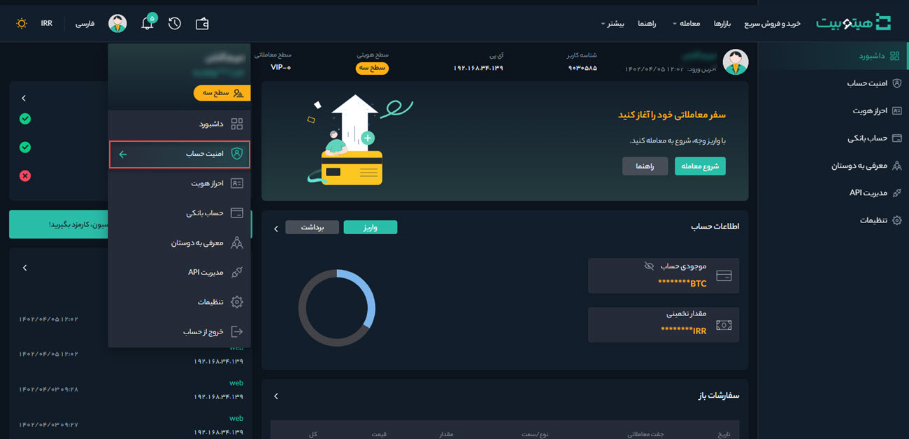
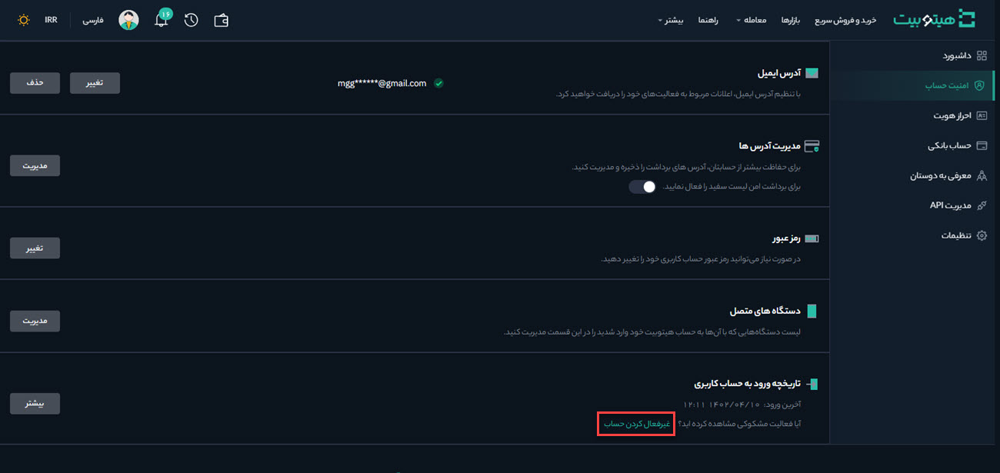
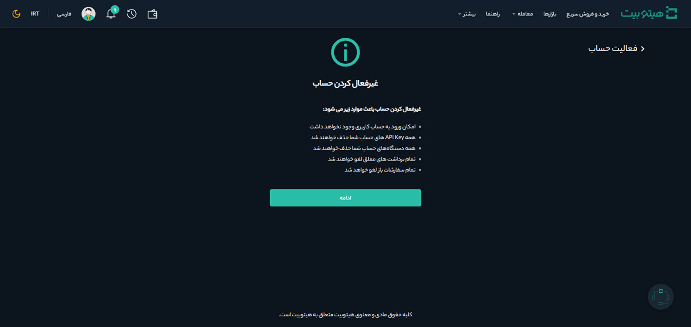
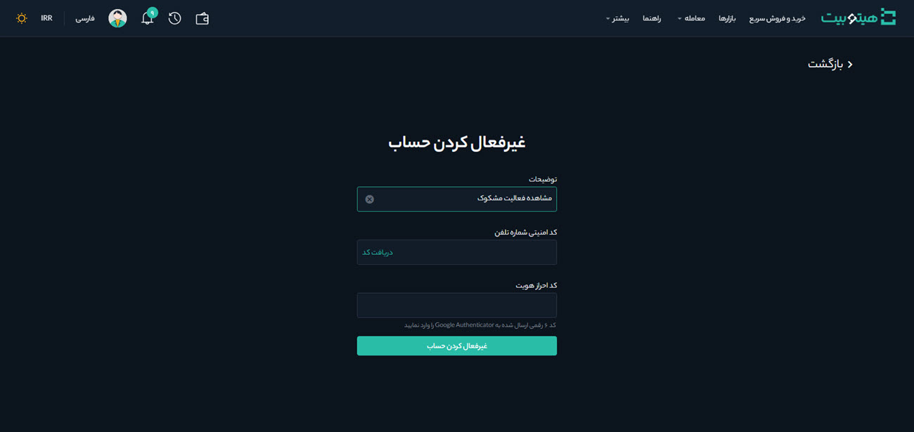

#  غیرفعال‌کردن حساب کاربری 

در صورت مشاهده هرگونه فعالیت مشکوک، می‌توانید با انجام مراحل زیر حساب کاربری خود را از طریق وب‌سایت غیرفعال کنید.

**1.**	از آدرس هیتوبیت وارد حساب کاربری خود شوید و از منوی پروفایل، صفحه **[امنیت حساب]** را باز کنید.

**2.**	روی **[غیرفعال‌کردن حساب]** کلیک کنید.

**3.**	یادآوری‌ها را بادقت بخوانید و روی **[ادامه]** کلیک کنید.

**4.**  دلیل غیرفعال کردن حساب خود را در **توضیحات**، کد امنیتی ارسال‌شده به تلفن همراه را در  **[کد امنیتی شماره تلفن]** و کد Google Authenticator را در **[حراز هویت]** وارد کنید. سپس بر روی **[غیرفعال‌کردن حساب]** کلیک کنید.

> **توجه**  هنگامی که حساب شما غیرفعال شد، برای فعال‌سازی مجدد آن با پشتیبانی تماس بگیرید.

 