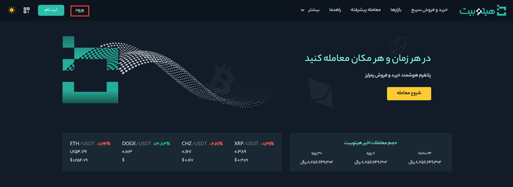
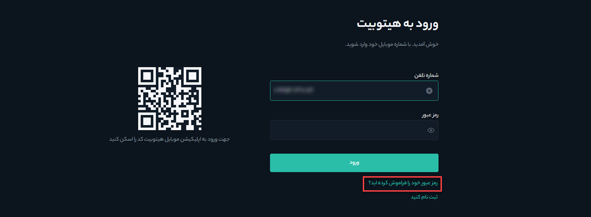
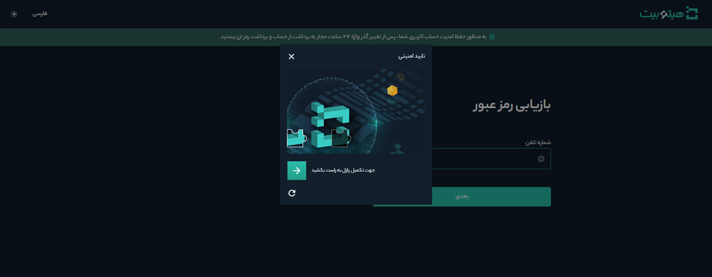
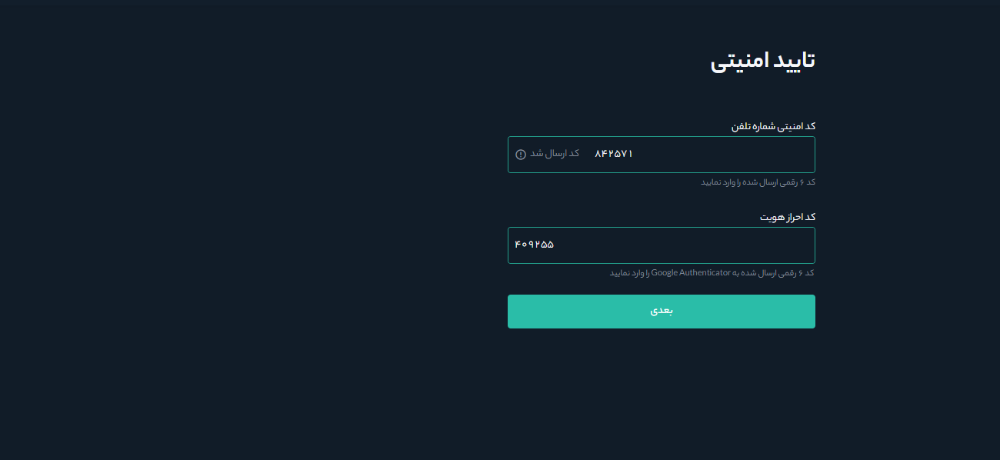
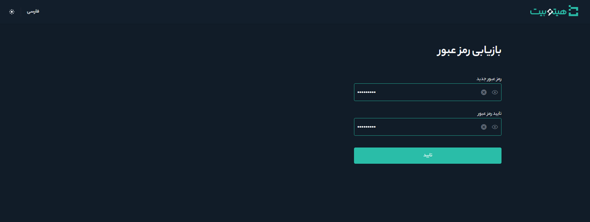
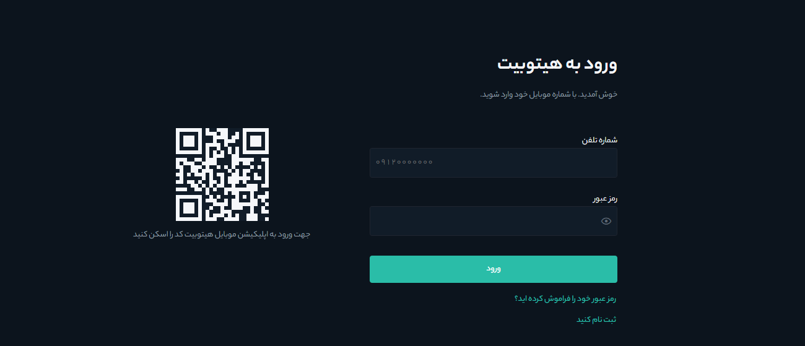

# بازیابی رمز عبور حساب کاربری

شما می‌توانید در صورت فراموشی رمز عبور حساب خود، آن را با انجام مراحل زیر از طریق وب‌سایت بازیابی کنید.  
> **توجه**  
  به منظور حفظ امنیت حساب کاربری شما، برداشت از حساب به مدت 24 ساعت پس از بازیابی رمز عبور، معلق خواهد شد.

**1.**	به سایت هیتوبیت بروید و بر روی **[ورود]** کلیک کنید تا وارد حساب کاربریتان شوید.

**2.**	در صفحه ورود، روی **[رمز عبور خود را فراموش کرده‌اید؟]** کلیک کنید.

**3.**	شماره موبایل خود را وارد کنید و بر روی **[بعدی]** کلیک کنید.

**4.**	پازل امنیتی را تکمیل کنید.

**5.**  کد دریافت شده را در قسمت **[کد امنیتی شماره تلفن]** و کد Google Authenticator را در قسمت **[کد احراز هویت]** وارد کنید. پس از تکمیل اطلاعات بر روی **[بعدی]** کلیک کنید.

**6.**	 رمز عبور جدید خود را دو بار وارد و بر روی **[تایید]** کلیک کنید.

**7.**	رمز عبور شما با موفقیت بازیابی شد. زین پس از رمز عبور جدید برای ورود به حساب کاربری خود استفاده کنید.

