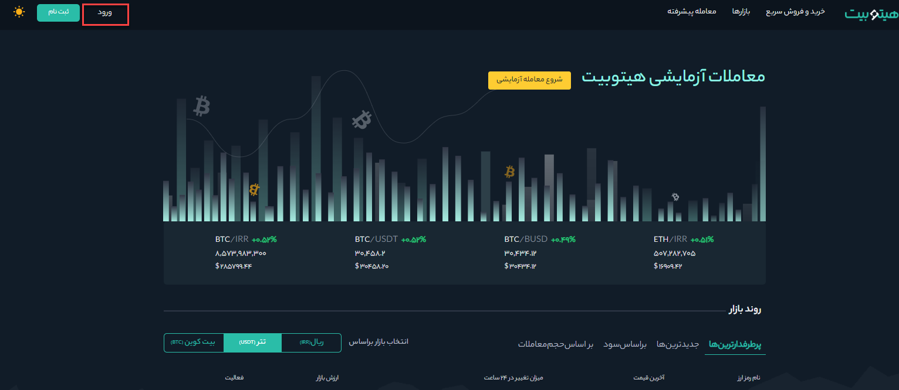
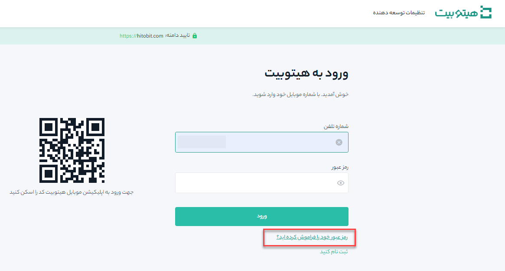
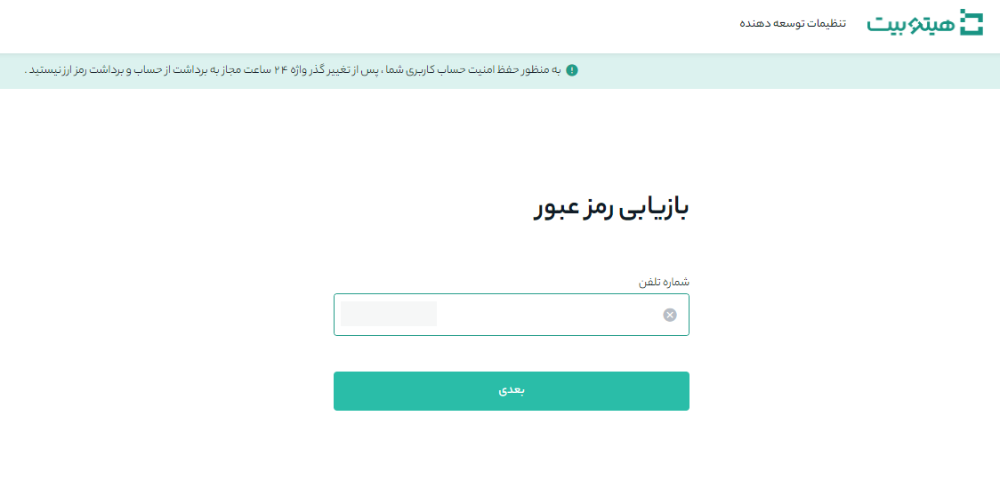
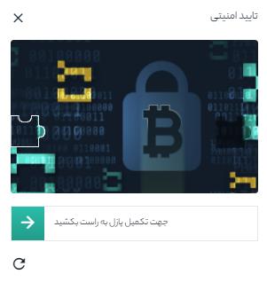
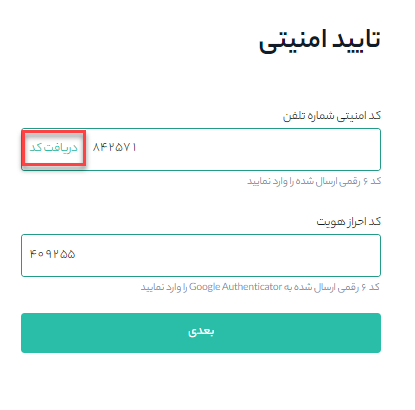
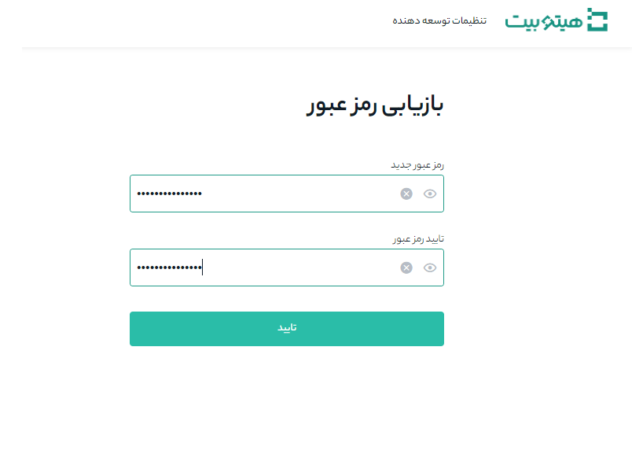
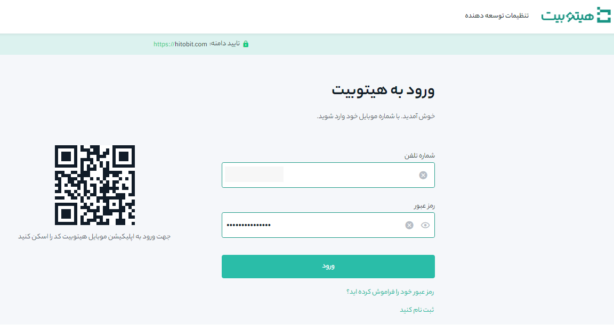

# بازیابی رمز عبور حساب کاربری

شما می‌توانید رمز عبور حساب خود را از طریق وب‌سایت بازیابی کنید. 

> توجه داشته باشید که به دلایل امنیتی، برداشت از حساب شما به مدت 24 ساعت پس از بازیابی رمز عبور معلق خواهد شد.

**1.**	به سایت هیتوبیت بروید و بر روی **[ورود]** کلیک کنید تا وارد حساب کاربریتان شوید.

**2.**	در صفحه ورود، روی **[رمز عبور خود را فراموش کرده‌اید؟]** کلیک کنید.

**3.**	شماره موبایل خود را وارد کنید و بر روی **[بعدی]** کلیک کنید.

**3.**	پازل امنیتی را تکمیل کنید.

**4.** تایید امنیتی: با زدن **[دریافت کد]**، کد دریافت شده را در قسمت **[کد امنیتی شماره تلفن]** و کد google authenticator را در قسمت **[کد احراز هویت]** وارد کنید. پس از تکمیل اطلاعات بر روی **[بعدی]** کلیک کنید.

**5.**	بازیابی رمز عبور: رمز عبور جدید خود را وارد کرده و روی **[تایید]** کلیک کنید.

**6.**	رمز عبور شما با موفقیت بازیابی شد. زین پس از رمز عبور جدید برای ورود به‌حساب کاربری خود استفاده کنید.

