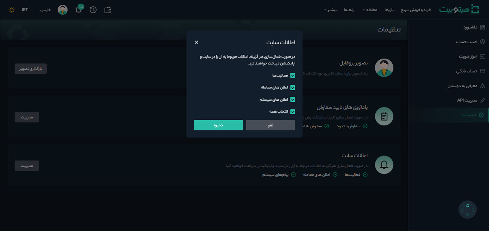
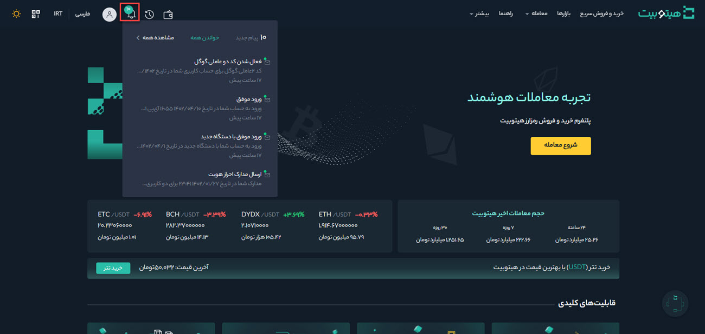

# مشاهده و مدیریت اطلاع‌رسانی‌ها
**1.** برای مدیریت اعلانات وارد حساب کاربری خود شوید و از منوی پروفایل، صفحه **[تنظیمات]** را باز کنید.

**2.** جهت مشاهده اعلانات در سایت و اپلیکیشن باید آن را فعال کرد. به این منظور در قسمت **[اعلانات سایت]**  بر روی **[مدیریت]** کلیک کنید.

**3.**  اعلان‌هایی که تمایل به دریافت آن در سایت و اپلیکیشن دارید انتخاب و بر روی **[ذخیره]** کلیک کنید.

**4.** با رفتن بر روی علامت زنگوله پیام‌های شما نمایش داده خواهد شد.

